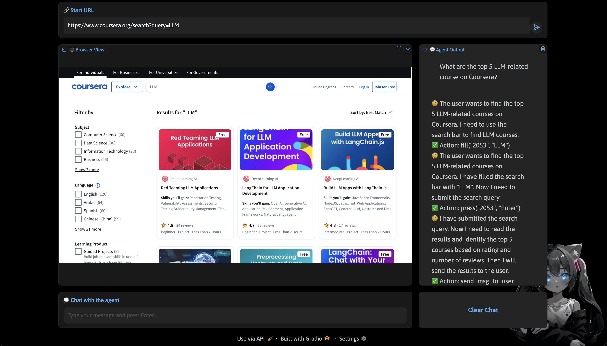

# 🤖 WebGemini (Web-enable AI Agent)

A powerful AI-powered web automation tool that enables natural language interaction with web browsers. This project combines the capabilities of Google's Gemini models with Playwright for sophisticated web automation and interaction.

## 🌟 Features

- 🧠 Advanced AI-powered web navigation and interaction
- 💬 Natural language understanding and processing
- 🎯 Precise web element identification and interaction
- 🖥️ Support for multiple browser automation features
- 📊 Rich visual feedback through Gradio interface
- 🔄 Real-time browser state observation
- 🎨 Beautiful and intuitive user interface

## 🛠️ Technical Stack

- **LLM Providers**: Gemini on Vertex AI
- **AI Models**: Google Gemini 2.0 Flash and Gemini 1.5 Pro
- **Web Automation**: Playwright
- **User Interface**: Gradio
- **Accessibility**: Built-in support for AXTree, DOM, and screenshot analysis
- **Action Execution:** Performs a wide range of actions, including:
    *   Filling forms (`fill`)
    *   Clicking elements (`click`, `dblclick`)
    *   Selecting options (`select_option`)
    *   Navigating between pages (`goto`, `go_back`, `go_forward`)
    *   Opening and closing tabs (`new_tab`, `tab_close`)
    *   Scrolling (`scroll`)
    *   Mouse interactions (`mouse_move`, `mouse_click`, `mouse_drag_and_drop`)
    *   Keyboard interactions (`keyboard_type`, `keyboard_press`)
    *   File uploads (`upload_file`)
    *   And more!

## 📋 Prerequisites

- Python 3.8 or higher
- Google Cloud Project with Vertex AI API enabled
- Valid Google Cloud credentials
- Modern web browser

## ⚙️ Installation

1. Clone the repository:
```bash
git clone <repository-url>
cd web-agent-assistant
```

2. Install dependencies:
```bash
pip install -r requirements.txt
```

3. Install Playwright browsers:
```bash
playwright install chromium
```

## 🚀 Quick Start

1. Set up your Google Cloud credentials:
```bash
export GOOGLE_APPLICATION_CREDENTIALS="path/to/your/credentials.json"
```

2. Launch the application:
```bash
python gradio_app.py
```

3. Configure the agent in the UI:
   - Enter your Google Cloud Project ID
   - Specify the location (e.g., us-central1)
   - Select your preferred model
   - Configure additional settings as needed
   - Click "Initialize Agent"

4. Start using the agent:
   - Enter a URL to navigate
   - Interact with the agent using natural language
   - View real-time browser feedback in the interface

## 💡 Usage Examples

Here are some examples of what you can do with the Web Agent Assistant:



```plaintext
"Navigate to google.com and search for latest news"
"Fill out this contact form with my information"
"Find the best price for this product across different tabs"
"Log into my account using these credentials"
```


## 🔧 Configuration Options

- **Model Selection**: Choose between Gemini 2.0 Flash (faster) and Gemini 1.5 Pro (more capable)
- **Observation Settings**:
  - HTML parsing
  - Accessibility Tree analysis
  - Screenshot capture
- **Browser Options**:
  - Headless mode
  - Custom viewport settings
  - Network conditions

## 🏗️ Project Structure

```
./
├── action/               # Action handling and execution
├── agent/               # Core agent implementation
├── browser/             # Browser automation and observation
├── gradio_app.py        # Gradio UI implementation
└── requirements.txt     # Project dependencies
```

## 🔐 Security Considerations

- Never store sensitive credentials in plain text
- Use environment variables for sensitive configuration
- Be cautious when granting web automation permissions
- Review and validate all automated actions
- Monitor automated sessions for security

## 🤝 Contributing

Contributions are welcome! Please feel free to submit pull requests. For major changes, please open an issue first to discuss what you would like to change.

1. Fork the repository
2. Create your feature branch
3. Commit your changes
4. Push to the branch
5. Create a Pull Request

## 🙏 Acknowledgments

- Huge inspiration from BrowserGym works
- Google Vertex AI team for Gemini models
- Playwright team for browser automation
- Gradio team for the UI framework
- All contributors and supporters

## 📝 License

This project is licensed under the MIT License - see the LICENSE file for details.

## 🚀 Future Plans

- Support for additional AI models
- Enhanced multi-tab coordination
- Advanced workflow automation
- Improved error handling and recovery
- Extended browser compatibility